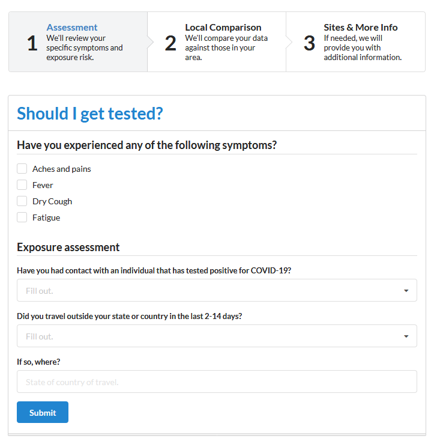
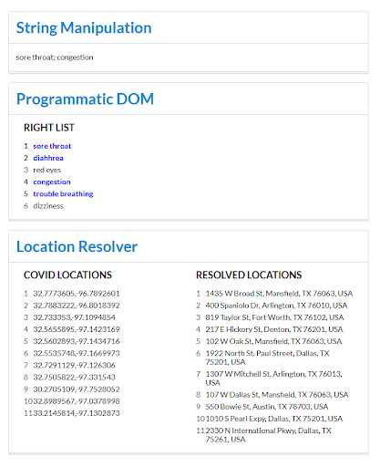

## My Corona
A two part class assignment building an attractive and usable form interface for users to fill out questions. The second part is to display results after processing input from user and using Google API

## Motivation
Practice HTML, HAML, CSS semantic-ui framework, jQuery, underscore, AJAX ( jQuery $.ajax helper function )

## Demo / Images

## Installation
1) Create a new EC2 Cloud 9 instance
2) In Cloud 9 terminal:
	a) git clone https://github.com/kenh7/module4-my-corona.git
	b) cd module4-my-corona
	c) bundle install
3) Run project

## Credits
Originally cloned from https://github.com/CSE3392-S2020/module4-my-corona
